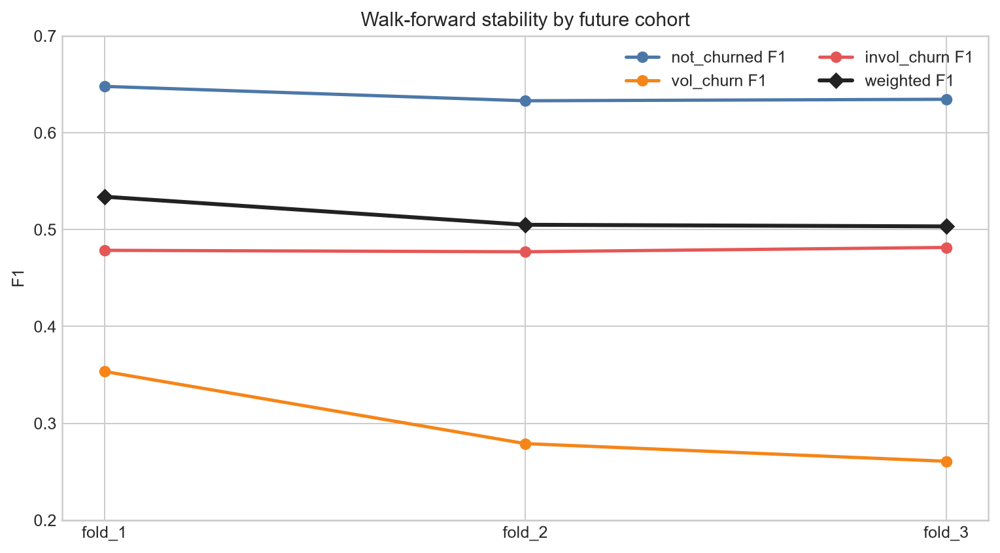
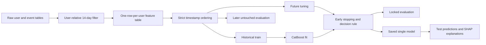
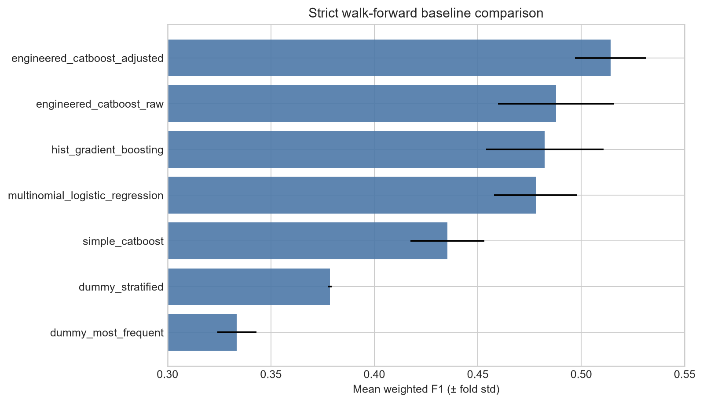

# Higgsfield churn prediction

Research-oriented multiclass churn pipeline for predicting the first-month outcome from a user's first 14 days: `not_churned`, `vol_churn`, or `invol_churn`.

The repository emphasizes leakage-safe temporal validation, reproducible experiments, honest uncertainty, class-level diagnostics, and explanations separated from business hypotheses.

## Result at a glance

| Evaluation | Weighted F1 | Macro F1 | not_churned F1 | vol_churn F1 | invol_churn F1 |
|---|---:|---:|---:|---:|---:|
| 3-fold walk-forward, mean | **0.5141 ± 0.0173** | 0.4718 ± 0.0188 | 0.6385 | 0.2978 | 0.4791 |
| Untouched final temporal cohort | **0.5068** | 0.4616 | 0.6395 | 0.2803 | 0.4649 |

The raw final weighted F1 is 0.4674. A class decision rule selected only on the preceding tuning cohort raises it to 0.5068. CatBoost probabilities are not calibrated, and adjusted decision scores must not be interpreted as probabilities.



## Problem and data

The model uses user properties, payment attempts, purchases, and onboarding quiz answers. Train contains 90,000 labeled users; test contains 7,000 users.

- Events are retained only in the user-relative interval `[subscription_start_date, +14 days)`.
- Every modeling table has exactly one row per user.
- Target, user ID, and absolute signup timestamp are excluded from model features.
- `test_users_generations.csv` is intentionally excluded because it has no train counterpart and cannot produce reproducible supervised features.
- Source timestamps are anonymized; their absolute year has no semantic meaning and is used only for temporal ordering.

## Leakage-safe validation

Users are sorted by exact signup timestamp. Each fold contains a historical train block, a later tuning block, and a still later evaluation block. Early stopping and class decision multipliers use tuning only; the future evaluation cohort remains untouched.



The three evaluation folds contain 15,000 users each; their adjusted weighted F1 values are 0.5340, 0.5050, and 0.5033.

## Baselines and experiments

| Model | Mean weighted F1 | Fold std |
|---|---:|---:|
| Dummy most frequent | 0.3335 | 0.0094 |
| Dummy stratified | 0.3785 | 0.0008 |
| Simple CatBoost | 0.4353 | 0.0178 |
| Multinomial logistic regression | 0.4779 | 0.0200 |
| HistGradientBoosting | 0.4823 | 0.0284 |
| Engineered CatBoost, raw argmax | 0.4878 | 0.0280 |
| Engineered CatBoost, tuning-selected decision rule | **0.5141** | 0.0173 |

Focused studies cover feature-group ablations, 1/3/7/14-day observation windows, a small hyperparameter screen, and single-seed versus three-seed inference. The ensemble was rejected because it did not improve mean weighted F1. A slower regularized model gained only 0.0014 on development folds—below between-fold variability—so the simpler depth-7 model was retained.



All measured configurations are tracked in [`artifacts/experiments.csv`](artifacts/experiments.csv); detailed conclusions are in [`artifacts/hypotheses_report.md`](artifacts/hypotheses_report.md).

## Explainability, errors, and drift

- Permutation importance is evaluated on every future user in each fold.
- SHAP is computed on 1,500 users per fold and for all 7,000 test users.
- Association discovery uses the historical 60,000 users; the next 15,000 users form a separate validation cohort.
- Benjamini–Hochberg FDR correction and direction replication are required. 19 of 54 tested associations pass both checks.
- The largest final error is `vol_churn → not_churned` (2,363 users).
- Payment and geography features are predictive but also exhibit cohort drift; maximum categorical Jensen–Shannon divergence is 0.161.

Payment/CVC/3-D Secure signals are associated with involuntary churn. Quiz cost concern and selected use-case/role segments replicate for voluntary churn, but quiz ablation does not demonstrate incremental model value. These are observational associations, not causal effects.

`user_insights.csv` explicitly separates model explanation from operational context: SHAP fields describe raw-score contributions; suggested actions are rule-based hypotheses. `decision_margin` is a score gap, not confidence.

## Reproduce

Tested with Python 3.12.13 on Windows PowerShell.

```powershell
python -m venv .venv
.\.venv\Scripts\python.exe -m pip install -r requirements.txt
```

Expected input layout:

```text
train/train_users.csv
train/train_users_properties.csv
train/train_users_transaction_attempts*.csv
train/train_users_purchases.csv
train/train_users_quizzes.csv
test/<matching test files>
```

Run tests and the selected pipeline:

```powershell
.\.venv\Scripts\python.exe -m unittest discover -s tests -v
.\.venv\Scripts\python.exe scripts\evaluate.py
.\.venv\Scripts\python.exe scripts\train.py
.\.venv\Scripts\python.exe scripts\predict.py
.\.venv\Scripts\python.exe scripts\analyze.py
.\.venv\Scripts\python.exe portfolio_report.py
```

Focused experiments are deliberately separate because they are computationally expensive:

```powershell
.\.venv\Scripts\python.exe scripts\experiments.py baselines
.\.venv\Scripts\python.exe scripts\experiments.py ablation
.\.venv\Scripts\python.exe scripts\experiments.py windows
.\.venv\Scripts\python.exe scripts\experiments.py ensemble
.\.venv\Scripts\python.exe scripts\experiments.py tuning
.\.venv\Scripts\python.exe scripts\experiments.py final-window
```

## Repository structure

```text
src/churn/                  public pipeline interfaces and configuration
scripts/                    train, evaluate, predict, analyze, experiment entry points
tests/                      leakage, schema, aggregation, inference tests
churn_pipeline.py           end-to-end feature, validation, model, and inference implementation
*_experiments.py            baseline and focused research studies
*_analysis.py               error, drift, SHAP, permutation, and association analysis
portfolio_report.py         consolidated registry, report, and portfolio figures
artifacts/                  metrics, predictions, model, evidence tables, reports, figures
```

## Key artifacts

- [`research_report.md`](artifacts/research_report.md) — full methodology, findings, limitations, and business implications.
- [`submission.csv`](artifacts/submission.csv) — two-column test submission.
- [`submission_with_probabilities.csv`](artifacts/submission_with_probabilities.csv) — raw uncalibrated probabilities plus prediction.
- [`metrics.json`](artifacts/metrics.json), [`walk_forward_metrics.csv`](artifacts/walk_forward_metrics.csv) — locked and fold-level metrics.
- [`catboost_final.cbm`](artifacts/catboost_final.cbm) — selected single production model.
- [`test_model_explanations.csv`](artifacts/test_model_explanations.csv), [`user_insights.csv`](artifacts/user_insights.csv) — model explanations and separate intervention context.
- [`churn_driver_evidence.csv`](artifacts/churn_driver_evidence.csv), [`categorical_drift.csv`](artifacts/categorical_drift.csv) — statistically validated associations and cohort shift.
- [`error_analysis_report.md`](artifacts/error_analysis_report.md) — class and transition-level failure analysis.

## Limitations

- Test labels are unavailable, so local test quality cannot be reported.
- The final holdout is one future cohort; the promising 3-day challenger needs replication.
- Probabilities are uncalibrated and the objective is weighted F1, not intervention cost or lifetime value.
- High-importance country, bank, funding, and 3-D Secure variables also drift and may act as proxies.
- Observational associations do not establish causality; proposed interventions require controlled experiments.
- `src/churn` offers stable interfaces, while much of the implementation remains centralized in `churn_pipeline.py` and could be decomposed further.

## Responsible use

Use predictions to prioritize review or experiments, not to deny service. Monitor per-class quality, drift, and segment-level disparities. Validate payment-recovery and retention actions through A/B tests with customer-experience guardrails.
